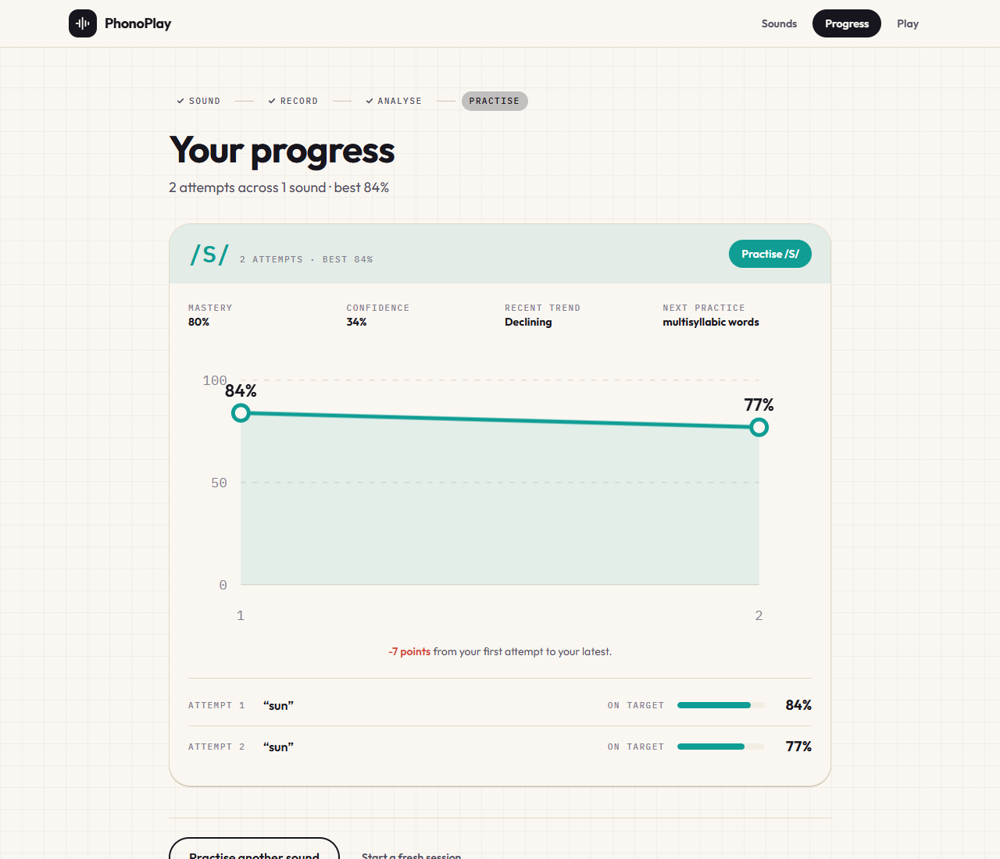

# PhonoPlay

PhonoPlay is a local-first English pronunciation practice prototype. A learner
records a target sound, receives acoustic feedback grounded in that recording,
and sees a practice plan adapt from repeated evidence.

> PhonoPlay provides educational pronunciation feedback. It is not a medical
> diagnosis, treatment, or assessment of a speech or learning condition.

**Current MVP:** Bangla or English as a first-language context; English as the
only measurable target language; `/s/`, `/r/`, `/l/`, and `/th/` as target
sounds.

## Product at a glance

```
Assess -> Profile -> Syllabus -> Practice -> Analyze -> Update -> Adapt
```

- A short assessment measures real recordings and creates a pronunciation
  profile. A refused or low-confidence recording does not become a fake score.
- The learner model lives in IndexedDB and tracks measured similarity,
  confidence, repetition, consistency, contrast results, and trend.
- The adaptive syllabus changes the next lesson: it can advance, reinforce,
  simplify, or keep the current step.
- Sound Lab makes the result inspectable with replay, waveform, measured
  acoustic evidence, confidence, and a clear next cue.
- Sound Contrast Lab supports listening and production practice for supported
  minimal pairs, including TH/T.

## Screens

### Captured Progress view



The app also includes Landing, Onboarding, Assessment, Profile, Adaptive
Syllabus, Practice, Sound Lab, Sound Contrast Lab, Progress, Sound Sprint, and
Settings screens. Screens that show scores label them as recording-level
practice similarity, not a clinical measure.

> The screenshot above is an existing captured app screen. Do not substitute
> generated mockups for real analysis results. Capture the current Landing,
> Sound Lab, and Adaptive Syllabus screens from a running browser before a
> public demo or submission.

## What is measured - and what is not

PhonoPlay deliberately separates three jobs:

| Layer | What it does | What it does not do |
|---|---|---|
| Speech recognition | Groq Whisper can produce a transcript in the older transcription flow. | It does not score pronunciation. |
| Acoustic analysis | Normalizes audio, checks quality, finds the target segment, extracts acoustic features, and compares them with reference profiles. | It does not diagnose a learner or claim certainty when evidence is weak. |
| Exercise generation | Groq can create bounded practice wording after the local model selects a sound and practice stage. | It never creates scores or changes the learner model. |

The acoustic result is a similarity estimate for one recording. If the audio
is too noisy, clipped, silent, or ambiguous, the system states uncertainty and
offers a retry rather than forcing a phoneme label.

## Accessibility Mode

Accessibility Mode is an alternative learning experience for learners who
prefer smaller, calmer steps. It is not a medical mode and does not treat
dyslexia or any condition.

It provides:

- a compact, predictable real-audio baseline assessment;
- a slower ladder: sound -> syllable -> sound pair -> word -> phrase -> sentence;
- phoneme isolation, TH/T contrast work, replay, mouth guides, and text cues;
- more repetitions and stronger consistency evidence before advancement;
- progress-focused rewards without timers or XP penalties for weak attempts.

## Privacy and data handling

- Raw recordings are captured in memory, reviewed by the learner, sent for
  analysis only after an explicit action, and never stored in IndexedDB.
- The pronunciation service temporarily normalizes audio for the request, then
  discards it. The browser persists only settings and derived practice data.
- The legacy transcription flow can send audio to Groq for speech-to-text.
  Transcription is context only, not pronunciation evidence.
- Exercise generation receives no raw audio and no learner score history.
- The current adaptive loop has no accounts, cloud learner database, or
  requested personal details.

## Important limitations

- English is the only measurable target language today. Bangla is a supported
  first-language context, not a measurable target language.
- The reference profiles are based on a small synthetic adult-voice corpus.
  Results should not be interpreted as clinical accuracy or a general fact
  about a person's speech.
- The system currently supports four target sounds. It is a focused MVP, not
  comprehensive pronunciation coverage.
- A practice score can change because of recording conditions as well as
  production. Repeat, consistency, and confidence matter more than one result.

## Run locally

Requirements: Python 3.12+, Node 20+, and `ffmpeg`/`ffprobe` on `PATH`.

```bash
# API
cd api
python -m venv .venv
.venv/Scripts/pip install -e ".[dev]"
copy .env.example .env
.venv/Scripts/python -m uvicorn app.main:app --port 8000

# Web app (new terminal)
cd web
npm install
npm run dev
```

Open `http://localhost:5173`.

`GROQ_API_KEY` is server-side only. The real acoustic pipeline does not use
Whisper; Groq is optional for transcription and generated exercises. If Groq
is unavailable, exercise generation has a validated fallback bank.

## Verify

```bash
cd web
npm run lint
npm run typecheck
npm test
npm run build

cd ../api
.venv/Scripts/python -m pytest
```

## Architecture

- [Architecture overview](ARCHITECTURE.md)
- [Implementation and acoustic-analysis notes](docs/IMPLEMENTATION.md)
- [Acoustic reference-data notes](api/app/acoustic/reference/README.md)

The central design rule is simple: **audio-derived evidence changes the
syllabus; generated text does not change the evidence.**
